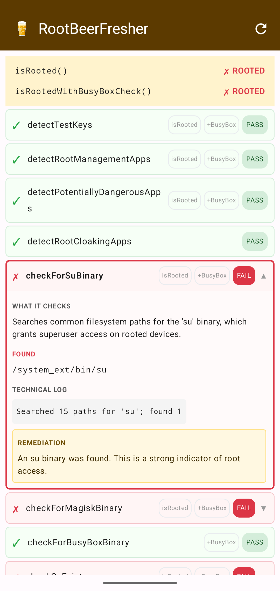
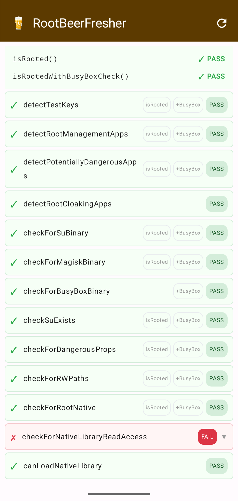

# RootBeerFresher

  

> A modern Android root-detection app powered by [RootBeer](https://github.com/scottyab/rootbeer).

-green)

  
    &nbsp;&nbsp;&nbsp;
  

[⬇ Download APK](https://github.com/csu333/RootBeerFresher/releases/latest)

---

## What it does

RootBeerFresher runs 13 root-detection checks on your Android device and shows
the result of each in real time. Tap any flagged check to see exactly what was
found — the package name, binary path, or system property that triggered it —
along with a plain-English explanation and a remediation hint.

## Checks

| # | Check | What it looks for |
|---|---|---|
| 1 | Test keys | Firmware signed with test keys instead of release keys |
| 2 | Root management apps | Magisk, SuperSU, KingRoot, Framaroot, … |
| 3 | Dangerous apps | ROM managers, Lucky Patcher, modded app stores, … |
| 4 | Root cloaking apps | RootCloak, Xposed Framework, Substrate, … |
| 5 | su binary | `su` in common filesystem paths |
| 6 | Magisk binary | `magisk` in common filesystem paths |
| 7 | BusyBox binary | `busybox` in common filesystem paths |
| 8 | su in PATH | `su` accessible via `which su` |
| 9 | Dangerous props | `ro.debuggable=1` or `ro.secure=0` |
| 10 | R/W system paths | `/system`, `/vendor/bin`, `/sbin`, `/etc` mounted read-write |
| 11 | Root (native) | Native C++ scan for the `su` binary |
| 12 | Native lib access | Unrestricted native library reads (SELinux permissive indicator) |
| 13 | Native lib load | RootBeer native detection library loadable |

## Requirements

Android 8.0 (API 26) or later. No root is required to run the app.

## Credits

Spiritual successor to [rootbeerFresh](https://github.com/KimChangYoun/rootbeerFresh) by KimChangYoun.

Built on [scottyab/rootbeer](https://github.com/scottyab/rootbeer).

## License

Licensed under the [European Union Public Licence v1.2](LICENSE)
